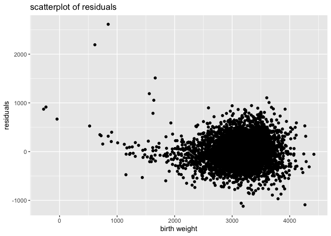
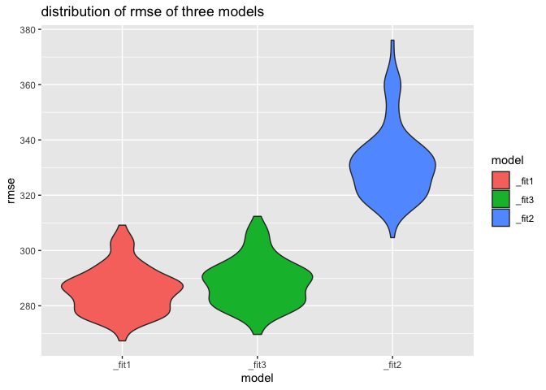
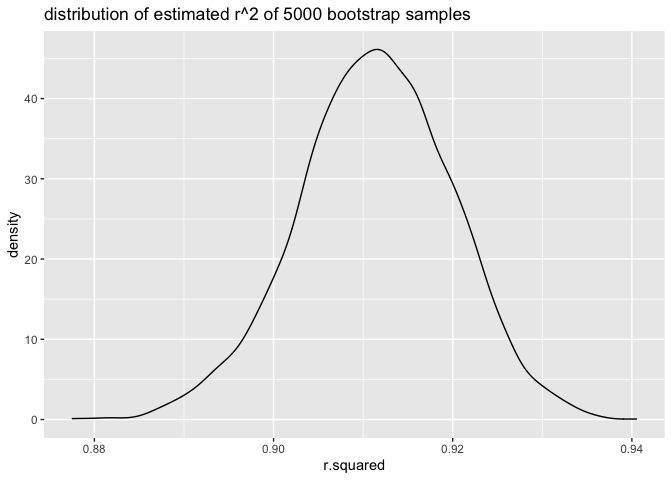
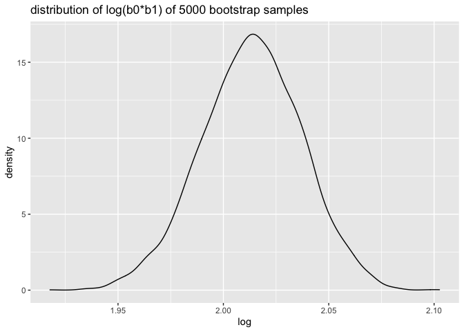

p8105\_HW6
================
Yongzi Yu yy3103

``` r
library(tidyverse)
```

    ## ── Attaching packages ─────────────────────────────────────── tidyverse 1.3.1 ──

    ## ✓ ggplot2 3.3.5     ✓ purrr   0.3.4
    ## ✓ tibble  3.1.2     ✓ dplyr   1.0.7
    ## ✓ tidyr   1.1.3     ✓ stringr 1.4.0
    ## ✓ readr   1.4.0     ✓ forcats 0.5.1

    ## ── Conflicts ────────────────────────────────────────── tidyverse_conflicts() ──
    ## x dplyr::filter() masks stats::filter()
    ## x dplyr::lag()    masks stats::lag()

``` r
library(broom)
library(purrr)
library(glmnet)
```

    ## Loading required package: Matrix

    ## 
    ## Attaching package: 'Matrix'

    ## The following objects are masked from 'package:tidyr':
    ## 
    ##     expand, pack, unpack

    ## Loaded glmnet 4.1-2

``` r
library(modelr)
```

    ## 
    ## Attaching package: 'modelr'

    ## The following object is masked from 'package:broom':
    ## 
    ##     bootstrap

# Problem 1

``` r
#check for missing data
bwt_df = read_csv("data/birthweight.csv")
```

    ## 
    ## ── Column specification ────────────────────────────────────────────────────────
    ## cols(
    ##   .default = col_double()
    ## )
    ## ℹ Use `spec()` for the full column specifications.

``` r
bwt_df[!complete.cases(bwt_df),]
```

    ## # A tibble: 0 x 20
    ## # … with 20 variables: babysex <dbl>, bhead <dbl>, blength <dbl>, bwt <dbl>,
    ## #   delwt <dbl>, fincome <dbl>, frace <dbl>, gaweeks <dbl>, malform <dbl>,
    ## #   menarche <dbl>, mheight <dbl>, momage <dbl>, mrace <dbl>, parity <dbl>,
    ## #   pnumlbw <dbl>, pnumsga <dbl>, ppbmi <dbl>, ppwt <dbl>, smoken <dbl>,
    ## #   wtgain <dbl>

-   There is no missing value for the data.

``` r
bwt_df = 
  read_csv("./data/birthweight.csv") %>% 
  janitor::clean_names() %>%
  mutate(
    babysex = as.factor(babysex),
    babysex = fct_recode(babysex, "male" = "1", "female" = "2"),
    frace = as.factor(frace),
    frace = fct_recode(frace, "white" = "1", "black" = "2", "asian" = "3", 
                       "puerto rican" = "4", "other" = "8"),
    malform = as.logical(malform),
    mrace = as.factor(mrace),
    mrace = fct_recode(mrace, "white" = "1", "black" = "2", "asian" = "3", 
                       "puerto rican" = "4"))
```

    ## 
    ## ── Column specification ────────────────────────────────────────────────────────
    ## cols(
    ##   .default = col_double()
    ## )
    ## ℹ Use `spec()` for the full column specifications.

``` r
lm1 <- lm(bwt_df,formula= bwt ~.)
summary(lm1)
```

    ## 
    ## Call:
    ## lm(formula = bwt ~ ., data = bwt_df)
    ## 
    ## Residuals:
    ##      Min       1Q   Median       3Q      Max 
    ## -1097.68  -184.86    -3.33   173.09  2344.15 
    ## 
    ## Coefficients: (3 not defined because of singularities)
    ##                     Estimate Std. Error t value Pr(>|t|)    
    ## (Intercept)       -6265.3914   660.4011  -9.487  < 2e-16 ***
    ## babysexfemale        28.7073     8.4652   3.391 0.000702 ***
    ## bhead               130.7781     3.4523  37.881  < 2e-16 ***
    ## blength              74.9536     2.0217  37.075  < 2e-16 ***
    ## delwt                 4.1007     0.3948  10.386  < 2e-16 ***
    ## fincome               0.2898     0.1795   1.614 0.106551    
    ## fraceblack           14.3313    46.1501   0.311 0.756168    
    ## fraceasian           21.2361    69.2960   0.306 0.759273    
    ## fracepuerto rican   -46.9962    44.6782  -1.052 0.292912    
    ## fraceother            4.2969    74.0741   0.058 0.953745    
    ## gaweeks              11.5494     1.4654   7.882 4.06e-15 ***
    ## malformTRUE           9.7650    70.6259   0.138 0.890039    
    ## menarche             -3.5508     2.8951  -1.226 0.220083    
    ## mheight               9.7874    10.3116   0.949 0.342588    
    ## momage                0.7593     1.2221   0.621 0.534418    
    ## mraceblack         -151.4354    46.0453  -3.289 0.001014 ** 
    ## mraceasian          -91.3866    71.9190  -1.271 0.203908    
    ## mracepuerto rican   -56.4787    45.1369  -1.251 0.210901    
    ## parity               95.5411    40.4793   2.360 0.018307 *  
    ## pnumlbw                   NA         NA      NA       NA    
    ## pnumsga                   NA         NA      NA       NA    
    ## ppbmi                 4.3538    14.8913   0.292 0.770017    
    ## ppwt                 -3.4716     2.6121  -1.329 0.183913    
    ## smoken               -4.8544     0.5871  -8.269  < 2e-16 ***
    ## wtgain                    NA         NA      NA       NA    
    ## ---
    ## Signif. codes:  0 '***' 0.001 '**' 0.01 '*' 0.05 '.' 0.1 ' ' 1
    ## 
    ## Residual standard error: 272.5 on 4320 degrees of freedom
    ## Multiple R-squared:  0.7183, Adjusted R-squared:  0.717 
    ## F-statistic: 524.6 on 21 and 4320 DF,  p-value: < 2.2e-16

-   Based on the summary of linear regression with all predictors,
    variables with higher estimate values and significant p-values are
    chosen.
-   I choose baby’s head circumference at birth `bhead`,children birth
    weight should have associations with baby’s sex `babysex`, baby’s
    length at birth `blength`,and `gaweeks`.

``` r
#linear regression model
fit1 = lm(bwt ~ blength + babysex + bhead + gaweeks, data = bwt_df)

bwt_df %>% 
  add_predictions(fit1) %>% 
  add_residuals(fit1) %>% 
  ggplot(aes(x = pred, y = resid)) +
  geom_point() +
  labs(
    title = "scatterplot of residuals",
    x = "birth weight",
    y = "residuals"
  )
```

<!-- -->

``` r
#run cv
fit1 = lm(bwt ~ bhead + blength + gaweeks +  babysex, data = bwt_df)

fit2 = lm(bwt ~ blength + gaweeks, data = bwt_df)

fit3 = lm(bwt ~ bhead + blength + babysex+ bhead*blength*babysex, data = bwt_df)

cv_df =
  crossv_mc(bwt_df, 100) %>% 
  mutate(
    test = map(test, as_tibble)
  ) %>%
  mutate(
    fit1 = map(.x = train, 
                   ~ lm(bwt ~ bhead + blength + gaweeks +  babysex,data = .x)),
    fit2 = map(.x = train, ~ lm(bwt ~ blength + gaweeks, data = .x)),
    fit3 = map(.x = train, ~ lm(bwt ~ bhead + blength + babysex+ bhead*blength*babysex, data = .x))
  ) %>%
  mutate(
    rmse_fit1 = map2_dbl(.x = fit1, .y = test, ~ rmse(model = .x, data = .y)),
    rmse_fit2 = map2_dbl(.x = fit2, .y = test, ~ rmse(model = .x, data = .y)),
    rmse_fit3 = map2_dbl(.x = fit3, .y = test, ~ rmse(model = .x, data = .y))
  )

cv_df %>% 
  pivot_longer(cols = starts_with("rmse"),
               names_to = "model",
               values_to = "rmse",
               names_prefix = "rmse") %>% 
  mutate(model = fct_reorder(model, rmse)) %>%
  ggplot(aes(x = model, y = rmse, fill = model)) +
  geom_violin() +
  labs(y = "rmse",
      title = "distribution of rmse of three models")
```

<!-- --> - Based
on the rmse plot, the second model which uses birth and gestational age
has higher rmse value. It means that second model has higher prediction
error. My model fit 1 is better than the second model and third model.

# Problem 2

``` r
weather_df = 
  rnoaa::meteo_pull_monitors(
    c("USW00094728"),
    var = c("PRCP", "TMIN", "TMAX"), 
    date_min = "2017-01-01",
    date_max = "2017-12-31") %>%
  mutate(
    name = recode(id, USW00094728 = "CentralPark_NY"),
    tmin = tmin / 10,
    tmax = tmax / 10) %>%
  select(name, id, everything())
```

    ## Registered S3 method overwritten by 'hoardr':
    ##   method           from
    ##   print.cache_info httr

    ## using cached file: ~/Library/Caches/R/noaa_ghcnd/USW00094728.dly

    ## date created (size, mb): 2021-10-05 10:03:40 (7.602)

    ## file min/max dates: 1869-01-01 / 2021-10-31

``` r
weather_df
```

    ## # A tibble: 365 x 6
    ##    name           id          date        prcp  tmax  tmin
    ##    <chr>          <chr>       <date>     <dbl> <dbl> <dbl>
    ##  1 CentralPark_NY USW00094728 2017-01-01     0   8.9   4.4
    ##  2 CentralPark_NY USW00094728 2017-01-02    53   5     2.8
    ##  3 CentralPark_NY USW00094728 2017-01-03   147   6.1   3.9
    ##  4 CentralPark_NY USW00094728 2017-01-04     0  11.1   1.1
    ##  5 CentralPark_NY USW00094728 2017-01-05     0   1.1  -2.7
    ##  6 CentralPark_NY USW00094728 2017-01-06    13   0.6  -3.8
    ##  7 CentralPark_NY USW00094728 2017-01-07    81  -3.2  -6.6
    ##  8 CentralPark_NY USW00094728 2017-01-08     0  -3.8  -8.8
    ##  9 CentralPark_NY USW00094728 2017-01-09     0  -4.9  -9.9
    ## 10 CentralPark_NY USW00094728 2017-01-10     0   7.8  -6  
    ## # … with 355 more rows

``` r
set.seed(666)

bootstrap_w = 
  weather_df %>%
  modelr::bootstrap(n = 5000,id="strap_number") %>%
  mutate(
    model = map(.x= strap, ~lm(tmax ~ tmin, data = .x)
  ))
  
rsquare_result = 
  bootstrap_w %>% 
  mutate(
    result = map(model, broom::glance),
  ) %>% 
  unnest(result) %>% 
  select(strap_number, r.squared)  

log_result = 
  bootstrap_w %>% 
  mutate(
    result = map(model, broom::tidy)
  ) %>% 
  unnest(result) %>% 
  group_by(strap_number) %>% 
  mutate(
  log = log(prod(estimate))
  ) %>% 
  filter(term == "tmin") %>% 
  select(strap_number, log)


rsquare_result %>% 
  ggplot(aes(x = r.squared)) +
  geom_density() +
  labs(title = "distribution of estimated r^2 of 5000 bootstrap samples")
```

<!-- -->

``` r
log_result %>% 
  ggplot(aes(x = log)) +
  geom_density() +
  labs(title = "distribution of log(b0*b1) of 5000 bootstrap samples")
```

<!-- --> - 2.5%
and 97.5% quantiles to provide a 95% confidence interval for r̂ 2 is .
0.8935331, 0.9274713 and for log(β̂ 0∗β̂ 1.9649829, 2.0591909

-   Based on the plot of distribution, it shows that the data is
    symmetric.
